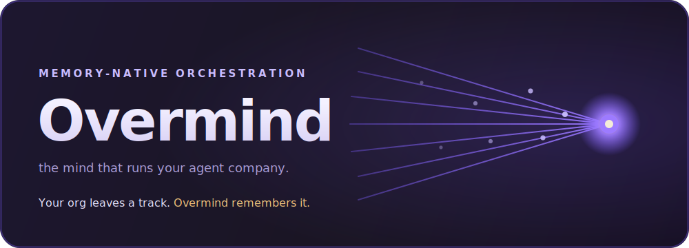
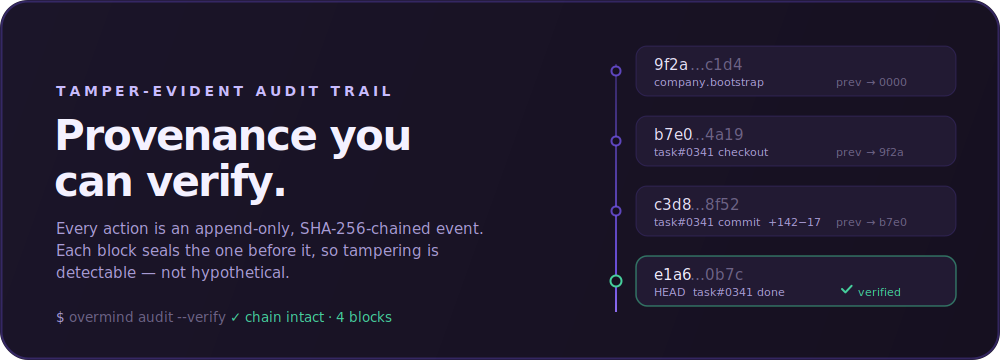
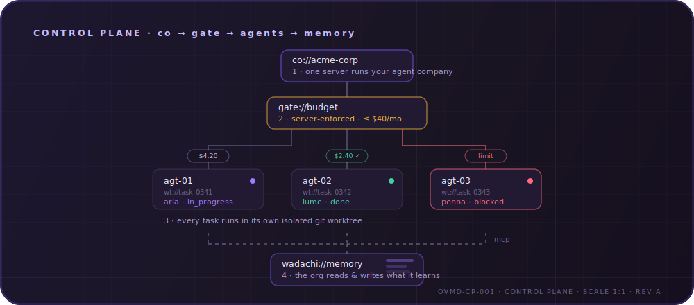

<!-- markdownlint-disable MD033 MD041 -->
<p align="center">
  <a href="#quickstart"><strong>Quickstart</strong></a> &middot;
  <a href="docs/VISION.md"><strong>Vision</strong></a> &middot;
  <a href="docs/ARCHITECTURE.md"><strong>Architecture</strong></a> &middot;
  <a href="docs/ROADMAP.md"><strong>Roadmap</strong></a> &middot;
  <a href="https://github.com/EliaCinti/overmind"><strong>GitHub</strong></a>
</p>

<p align="center">
  
</p>

<p align="center">
  <a href="LICENSE"></a>
  
  
  
</p>

<br/>

# Overmind — the mind that runs your agent company.

Open-source orchestration for teams of AI agents — **with a memory.**

**If an agent is an _employee_, Overmind is the _company_ — and it remembers.**

Overmind is a Rust server and a React UI that organizes AI agents into a company: org chart, budgets, governance, isolated git worktrees, and a tamper-evident audit trail. Bring your own agents, assign work, and watch it happen from one board.

What makes it different: Overmind is **memory-native**, and its brain is **[Wadachi](https://github.com/EliaCinti/wadachi) (轍)** — a persistent, semantically-searchable memory built for AI agents. Wadachi stores decisions with their _why_, the patterns your agents discover, and the mistakes already made, as a linked knowledge graph (a real Obsidian vault) that survives across every session and even proposes its own consolidations. Overmind ships with Wadachi as its **first-party brain**; the interface stays open (any MCP memory server works) and Overmind runs perfectly without one — but plug Wadachi in and your organization genuinely _learns_.

**Manage the work, not the terminals.**

|        | Step               | Example                                                                 |
| ------ | ------------------ | ----------------------------------------------------------------------- |
| **01** | Start a company    | Name it, point it at a git repo. One screen, you're running.            |
| **02** | Hire an agent      | Pick an archetype (_Security Engineer_, _Backend Dev_…), one click.     |
| **03** | Create a task      | Describe the work. An agent picks it up, in its own isolated worktree.  |
| **04** | Review & remember  | Read the diff, approve. The org stores what it learned for next time.   |

<br/>

## Provenance you can verify

Everyone runs agents. Overmind can **prove what every agent did.** Each action is an append-only, SHA-256-chained event, committed in the same transaction as the change it records — so history is tamper-evident, not just logged. Break the chain and `GET /audit/verify` pinpoints the exact block that no longer seals.

<p align="center">
  
</p>

<br/>

## Overmind is right for you if

- ✅ You run **several coding agents at once** and lose track of who's doing what
- ✅ You want agents that **learn from the org's past** instead of starting cold every session
- ✅ You want every agent to work in an **isolated git worktree**, with the diff in front of you before anything merges
- ✅ You want **budgets enforced server-side** — an agent over its cap is stopped, not trusted to behave
- ✅ You want **governance**: approve a start, pause or terminate an agent, roll back a config change
- ✅ You want a **tamper-evident** record of everything that happened — provably, not just a log file
- ✅ You want it **self-hosted**, no account, your data on your machine

<br/>

## Features

<table>
<tr>
<td align="center" width="33%">
<h3>🧠 Organizational Memory</h3>
The whole org shares a persistent brain — <strong>Wadachi</strong> — over MCP. Agents load relevant past context before working and record what they learned. Your company accumulates judgment. <em>Nobody else has this.</em>
</td>
<td align="center" width="33%">
<h3>🔌 Bring Your Own Agent</h3>
Any agent CLI, one org chart, via a configurable adapter command. Claude Code by default; point it at whatever you run.
</td>
<td align="center" width="33%">
<h3>🌳 Isolated Worktrees</h3>
Every run gets its own git worktree and branch. Agents never step on each other; you review the diff before it lands.
</td>
</tr>
<tr>
<td align="center">
<h3>🔒 Hash-Chained Audit</h3>
Every action is an append-only, SHA-256-chained event. Tamper with history and verification pinpoints the exact broken event.
</td>
<td align="center">
<h3>💰 Atomic Budgets</h3>
Per-agent monthly caps, enforced <em>inside</em> the task-checkout transaction. Over budget → stopped server-side. No runaway spend.
</td>
<td align="center">
<h3>🛡️ Governance</h3>
Approval gates that block until you sign off. Pause / resume / terminate agents. Config revisions with forward-only rollback.
</td>
</tr>
<tr>
<td align="center">
<h3>📊 Org Chart</h3>
Agents have titles and reporting lines; the reporting DAG is enforced server-side (no cycles). Hire a report under any node.
</td>
<td align="center">
<h3>💓 Heartbeats & Recovery</h3>
A scheduler wakes agents, resumes interrupted sessions after a restart, and releases timed-out work safely.
</td>
<td align="center">
<h3>🎨 Guided Hiring</h3>
Progressive disclosure: pick an archetype, tune with clicks, drop into expert mode only if you need it. Live "what this agent will do" preview.
</td>
</tr>
</table>

<br/>

## How it works

The control plane, drawn to scale: one server runs your company, every action passes a server-enforced budget gate, every task runs in an isolated git worktree, and every agent reads and writes organizational memory over MCP.

<p align="center">
  
</p>

1. **Company** — one server runs your whole agent org. Companies scope everything; agents have archetypes, titles, and reporting lines, and the reporting DAG is enforced server-side. Projects cascade into goals and tasks.
2. **Gate** — every action passes a server-enforced budget. Per-agent monthly caps are reserved atomically inside the task-checkout transaction; an over-budget agent is stopped, and the incident is recorded.
3. **Agents** — every task runs an agent CLI in its own isolated git worktree/branch. Output and cost are captured, sessions resume across restarts, and you review each diff before it lands.
4. **Memory** — every agent reads and writes **Wadachi** over MCP, so the org remembers. Overmind also exposes itself over MCP so external agents can file and read tasks. And every mutation above appends an immutable, hash-chained audit event.

<br/>

## Problems Overmind solves

| Without Overmind                                                                                   | With Overmind                                                                                        |
| -------------------------------------------------------------------------------------------------- | --------------------------------------------------------------------------------------------------- |
| ❌ Ten agent terminals open; on reboot you lose which did what.                                    | ✅ Work is task-based, sessions persist and resume across restarts, every step is on the board.      |
| ❌ Every session your agent starts cold — you re-paste the same context and it repeats old mistakes. | ✅ The org remembers: agents load past decisions and patterns before they start.                     |
| ❌ Agents edit the same tree and clobber each other.                                                | ✅ One isolated git worktree per run; concurrent agents never interfere; you review each diff.        |
| ❌ A runaway loop burns hundreds of dollars before you notice.                                      | ✅ Budgets are enforced atomically at checkout; an over-budget agent is stopped, incident recorded.  |
| ❌ "Did the agent really do what it claimed?" — you can't prove it.                                 | ✅ An append-only hash chain: history is tamper-evident and verifiable end to end.                    |

<br/>

## Why Overmind is special

|                                    |                                                                                                                    |
| ---------------------------------- | ------------------------------------------------------------------------------------------------------------------ |
| **Memory-native.**                 | A pluggable `MemoryProvider` over MCP — the org accumulates judgment across sessions. Optional, never a lock-in.    |
| **Atomic execution.**              | Task checkout and budget reservation commit in a single transaction — no double-work, no overrun.                  |
| **Tamper-evident by construction.**| The audit log is append-only (SQLite triggers) _and_ SHA-256 hash-chained; `GET /audit/verify` proves it.          |
| **Enforced, not suggested.**       | Archetype choices compile to server-enforced config (permissions, budget, gates) — a prompt can't override limits. |
| **Correctness-first stack.**       | Rust server (axum + SQLite), typed React UI — the concurrency-critical parts get compile-time guarantees.          |
| **Graceful degradation.**          | No memory server? Broken one? Tasks run identically. Memory failures are logged, never fatal.                      |

<br/>

## Powered by Wadachi

<a href="https://github.com/EliaCinti/wadachi">
  <picture>
    <source media="(prefers-color-scheme: dark)" srcset=".github/assets/wadachi-logomark.svg">
    
  </picture>
</a>

Overmind's memory isn't a bolt-on cache — it's **[Wadachi](https://github.com/EliaCinti/wadachi) (轍**, the ruts a wheel leaves in the road**)**, a persistent-memory engine for AI agents that Overmind adopts as its first-party brain.

- **Semantic recall.** Agents ask "what do we know about this?" and get the relevant past — decisions, patterns, prior fixes — ranked by relevance, not keyword-matched.
- **Decisions with their _why_.** Wadachi records not just what was chosen but the rationale and the alternatives rejected — the context future agents actually need.
- **A living knowledge graph.** Memories link to each other (an Obsidian-compatible vault); Wadachi even runs a "sleep" pass that proposes consolidations of what the org has learned.
- **Concurrency-safe.** Wadachi ≥ 0.14 handles many agents reading and writing at once, so Overmind's parallel runners share one brain without stepping on each other.
- **Separate, by design.** Wadachi is its own project — use it without Overmind, or Overmind without it. The only coupling is the open MCP protocol; neither vendors the other's code.

The result: an organization of agents that doesn't start from zero every morning.

<br/>

## Quickstart

### Docker (recommended)

```sh
docker compose up --build          # → http://localhost:7070
```

Persists the DB, worktrees and brains on a named volume. Mount your repos and set `OVERMIND_AGENT_CMD` to your agent CLI — see [`docker-compose.yml`](docker-compose.yml).

### From source

```sh
# 1. Build the UI (once, or after frontend changes)
cd web && npm install && npm run build && cd ..

# 2. Run the server — it serves the API, the live socket, and the built UI
cargo run                          # → http://127.0.0.1:7070

# Frontend dev with hot reload (proxies /api and /ws to the server):
cd web && npm run dev
```

### Organizational memory (optional)

Point Overmind at any MCP memory server exposing `get_context` / `store_memory` / `store_decision` — [Wadachi](https://github.com/EliaCinti/wadachi) is the reference:

```sh
OVERMIND_MEMORY_CMD="BRAIN_DIR=/path/to/brain wadachi" cargo run
```

Agents then load org context before working and record what they learned. Unset it and Overmind runs identically, memoryless.

### Configuration

| Env var | What |
|---|---|
| `OVERMIND_ADDR` | Listen address (default `127.0.0.1:7070`) |
| `OVERMIND_DB` | SQLite URL (default `sqlite://overmind.sqlite`) |
| `OVERMIND_DATA_DIR` | Worktrees & runtime data (default `./overmind-data`) |
| `OVERMIND_AGENT_CMD` | Agent adapter command (default: Claude Code CLI) |
| `OVERMIND_MEMORY_CMD` | MCP memory server command (unset = no memory) |
| `OVERMIND_MEMORY_POOL` | Concurrent memory connections (default `4`) |
| `OVERMIND_HEARTBEAT_SECS` | Scheduler tick (default `30`) |
| `OVERMIND_SESSION_TIMEOUT_SECS` | Kill sessions over this (default `3600`) |
| `OVERMIND_START_ESTIMATE_CENTS` | Budget reservation per start (default `50`) |
| `OVERMIND_WEB_DIR` | Built SPA to serve (default `./web/dist`) |

<br/>

## Status

Pre-alpha, built in the open. The core is done and tested: company & org chart, tasks & board, agent execution in worktrees, heartbeats & recovery, budgets & governance, hash-chained audit, and organizational memory over MCP. Next on the [roadmap](docs/ROADMAP.md): managed per-company brains + memory UI, Overmind as an MCP server, and container-based agent sandboxing.

The design is documented before the code: see [VISION](docs/VISION.md), [ARCHITECTURE](docs/ARCHITECTURE.md), the [UX principles](docs/UX.md), and the [Architecture Decision Records](docs/adr/).

<br/>

## Prior art & credits

Overmind's org layer is inspired by [Paperclip](https://github.com/paperclipai/paperclip) (MIT) and its execution layer by [Vibe Kanban](https://github.com/BloopAI/vibe-kanban). It adopts Paperclip's vocabulary and semantics where they serve (see [PAPERCLIP-ALIGNMENT](docs/PAPERCLIP-ALIGNMENT.md)) and contains **no AGPL code**. The organizational memory is powered by **[Wadachi](https://github.com/EliaCinti/wadachi)** — a sibling project, not a sub-component — integrated over MCP; the tamper-evident audit chain is Overmind's own.

## License

MIT — self-hosted, no account, yours.
