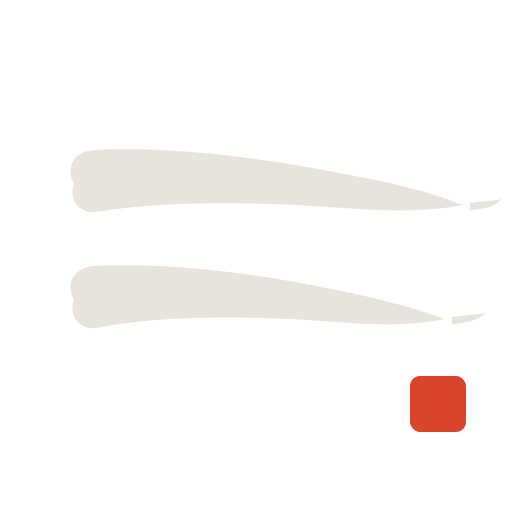

<div align="center">

<a href="https://github.com/EliaCinti/overmind">
  
</a>

**Ten agent terminals open, and by morning you've lost the thread. Overmind fixes that.**\
*Overmind (n.): the mind that runs your agent company.*

**Open-source orchestration for teams of AI agents — with a memory.**\
A Rust server + React UI that runs your agents as a company: org chart, budgets, governance, isolated git worktrees, and a tamper-evident audit trail.

[](LICENSE)


-7c5cff?style=flat&labelColor=1a1523)


**[Quickstart →](#quickstart)** &nbsp;·&nbsp; [Architecture](#architecture) &nbsp;·&nbsp; [Vision](docs/VISION.md) &nbsp;·&nbsp; [Roadmap](docs/ROADMAP.md)

</div>

---

## The Problem

You're running several coding agents at once, and it's chaos. Ten terminals open; on reboot you've lost which did what. Each session an agent starts cold — you re-paste the same context and it repeats a mistake it made last week. Two agents edit the same tree and clobber each other. A runaway loop burns hundreds of dollars before you notice. And when it's done, you can't actually prove what happened.

> *"Wait — which agent touched the auth module?"*\
> *"Why did it re-implement this? We decided against that last week."*\
> *"Did it really run the tests, or just say it did?"*

Agents make great employees. What's missing is the **company** around them.

## The Solution

Overmind runs your agents as an organization. You **start a company**, point it at a git repo, and **hire** agents with real archetypes, titles, and reporting lines. You **create tasks**; each one runs in its **own isolated git worktree**, so nothing collides and you review the diff before it lands. Budgets are **enforced server-side**, governance gates **block until you sign off**, and every action lands in a **tamper-evident, hash-chained audit log**.

And it **remembers**. Overmind is memory-native: its first-party brain is **[Wadachi](https://github.com/EliaCinti/wadachi) (轍)**, so your organization loads what it learned before it starts — instead of beginning every session from zero.

**Manage the work, not the terminals.**

## How it works

|        | Step               | What happens                                                            |
| :----: | ------------------ | ----------------------------------------------------------------------- |
| **01** | Start a company    | Name it, point it at a git repo. One screen, you're running.            |
| **02** | Hire an agent      | Pick an archetype (_Security Engineer_, _Backend Dev_…), one click.     |
| **03** | Create a task      | Describe the work. An agent picks it up in its own isolated worktree.   |
| **04** | Review & remember  | Read the diff, approve. The org stores what it learned for next time.   |

---

## Features

**🧠 Organizational Memory** — The whole org shares a persistent brain — **Wadachi** — over MCP. Agents load relevant past context before working and record what they learned. Your company accumulates judgment. *Nobody else has this.*

**🌳 Isolated Worktrees** — Every run gets its own git worktree and branch. Agents never step on each other; you review the diff before anything lands.

**💰 Atomic Budgets** — Per-agent monthly caps, enforced *inside* the task-checkout transaction. Over budget → stopped server-side, incident recorded. No runaway spend.

**🛡️ Governance** — Approval gates that block until you sign off. Pause / resume / terminate agents. Config revisions with forward-only rollback.

**🔒 Hash-Chained Audit** — Every action is an append-only, SHA-256-chained event, committed in the same transaction as the change it records. Tamper with history and `GET /audit/verify` pinpoints the exact broken event.

**📊 Org Chart** — Agents have titles and reporting lines; the reporting DAG is enforced server-side (no cycles). Hire a report under any node.

**🔌 Bring Your Own Agent** — Any agent CLI, one org chart, via a configurable adapter command. Claude Code by default; point it at whatever you run.

**💓 Heartbeats & Recovery** — A scheduler wakes agents, resumes interrupted sessions after a restart, and releases timed-out work safely.

**🎨 Guided Hiring** — Pick an archetype, tune it with clicks, drop into expert mode only if you need it — with a live "what this agent will do" preview.

---

## Architecture

<div align="center">

</div>

**Company & Org Chart** — Companies scope everything. Agents have archetypes, titles, and reporting lines; the reporting DAG is enforced server-side. Projects cascade into goals and tasks.

**Tasks & Board** — A kanban board (backlog → todo → in_progress → in_review → blocked → done), live over WebSocket, with diff review.

**Agent Runners & Sessions** — Each task runs an agent CLI in its own git worktree/branch; output and cost are captured; sessions resume across restarts.

**Budgets & Governance** — Per-agent monthly budgets enforced atomically at checkout; approval gates; pause / resume / terminate; config revisions with rollback.

**Audit (hash-chained)** — Every mutation appends an immutable, SHA-256-chained event, committed in the same transaction as the change it records.

**Memory (MCP)** — Overmind speaks MCP to **Wadachi**, its first-party brain — and exposes itself over MCP so external agents can file and read tasks.

> Design is documented before code: [ARCHITECTURE](docs/ARCHITECTURE.md) · [VISION](docs/VISION.md) · [UX principles](docs/UX.md) · [Architecture Decision Records](docs/adr/).

---

## Powered by Wadachi



Overmind's memory isn't a bolt-on cache — it's **[Wadachi](https://github.com/EliaCinti/wadachi) (轍**, the ruts a wheel leaves in a road**)**, a persistent-memory engine for AI agents that Overmind adopts as its first-party brain.

- **Semantic recall** — agents ask "what do we know about this?" and get the relevant past — decisions, patterns, prior fixes — ranked by relevance, not keyword-matched.
- **Decisions with their _why_** — Wadachi records not just what was chosen, but the rationale and the rejected alternatives.
- **A living knowledge graph** — memories link to each other (an Obsidian-compatible vault); a "sleep" pass even proposes consolidations of what the org has learned.
- **Concurrency-safe** — Wadachi ≥ 0.14 handles many agents reading and writing at once, so parallel runners share one brain without stepping on each other.
- **Separate, by design** — Wadachi is its own project; the only coupling is the open MCP protocol. Use either one without the other.

The result: an organization of agents that doesn't start from zero every morning. No memory server? A broken one? Tasks run identically — memory failures are logged, never fatal.

---

## Quickstart

**Docker (recommended)**

```sh
docker compose up --build          # → http://localhost:7070
```

Persists the DB, worktrees and brains on a named volume. Mount your repos and set `OVERMIND_AGENT_CMD` to your agent CLI — see [`docker-compose.yml`](docker-compose.yml).

**From source**

```sh
# 1 · build the UI (once, or after frontend changes)
cd web && npm install && npm run build && cd ..

# 2 · run the server — it serves the API, the live socket, and the built UI
cargo run                          # → http://127.0.0.1:7070

# frontend dev with hot reload (proxies /api and /ws to the server):
cd web && npm run dev
```

**Organizational memory (optional)** — point Overmind at any MCP memory server exposing `get_context` / `store_memory` / `store_decision`; [Wadachi](https://github.com/EliaCinti/wadachi) is the reference:

```sh
OVERMIND_MEMORY_CMD="BRAIN_DIR=/path/to/brain wadachi" cargo run
```

Unset it and Overmind runs identically, memoryless.

<details>
<summary><strong>Configuration</strong> — all environment variables</summary>

<br/>

| Env var | What |
|---|---|
| `OVERMIND_ADDR` | Listen address (default `127.0.0.1:7070`) |
| `OVERMIND_DB` | SQLite URL (default `sqlite://overmind.sqlite`) |
| `OVERMIND_DATA_DIR` | Worktrees & runtime data (default `./overmind-data`) |
| `OVERMIND_AGENT_CMD` | Agent adapter command (default: Claude Code CLI) |
| `OVERMIND_MEMORY_CMD` | MCP memory server command (unset = no memory) |
| `OVERMIND_MEMORY_POOL` | Concurrent memory connections (default `4`) |
| `OVERMIND_HEARTBEAT_SECS` | Scheduler tick (default `30`) |
| `OVERMIND_SESSION_TIMEOUT_SECS` | Kill sessions over this (default `3600`) |
| `OVERMIND_START_ESTIMATE_CENTS` | Budget reservation per start (default `50`) |
| `OVERMIND_WEB_DIR` | Built SPA to serve (default `./web/dist`) |

</details>

---

## Why it's different

- **Memory-native** — a pluggable `MemoryProvider` over MCP; the org accumulates judgment across sessions. Optional, never a lock-in.
- **Atomic execution** — task checkout and budget reservation commit in a single transaction. No double-work, no overrun.
- **Tamper-evident by construction** — the audit log is append-only (SQLite triggers) *and* SHA-256 hash-chained; `GET /audit/verify` proves it end to end.
- **Enforced, not suggested** — archetype choices compile to server-enforced config (permissions, budget, gates). A prompt can't override the limits.
- **Correctness-first stack** — a Rust (axum + SQLite) server and a typed React UI; the concurrency-critical parts get compile-time guarantees.

---

## Status

**Pre-alpha, built in the open.** The core is done and tested: company & org chart, tasks & board, agent execution in worktrees, heartbeats & recovery, budgets & governance, hash-chained audit, and organizational memory over MCP. Next on the [roadmap](docs/ROADMAP.md): managed per-company brains + memory UI, Overmind as an MCP server, and container-based agent sandboxing.

## Prior art & credits

Overmind's org layer is inspired by [Paperclip](https://github.com/paperclipai/paperclip) (MIT) and its execution layer by [Vibe Kanban](https://github.com/BloopAI/vibe-kanban). It adopts Paperclip's vocabulary where it serves (see [PAPERCLIP-ALIGNMENT](docs/PAPERCLIP-ALIGNMENT.md)) and contains **no AGPL code**. Organizational memory is powered by **[Wadachi](https://github.com/EliaCinti/wadachi)** — a sibling project, not a sub-component — integrated over MCP; the tamper-evident audit chain is Overmind's own.

## Contributing

PRs welcome — see [CONTRIBUTING.md](CONTRIBUTING.md). Overmind is pre-alpha and built in the open, so issues, ideas, and rough edges are especially useful right now.

## License

[MIT](LICENSE) — self-hosted, no account, yours.

---

<div align="center">
<sub>Built by <a href="https://eliacinti.dev">Elia Cinti</a></sub>
</div>
