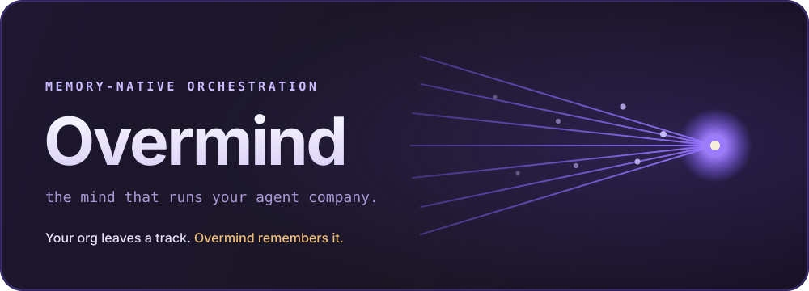
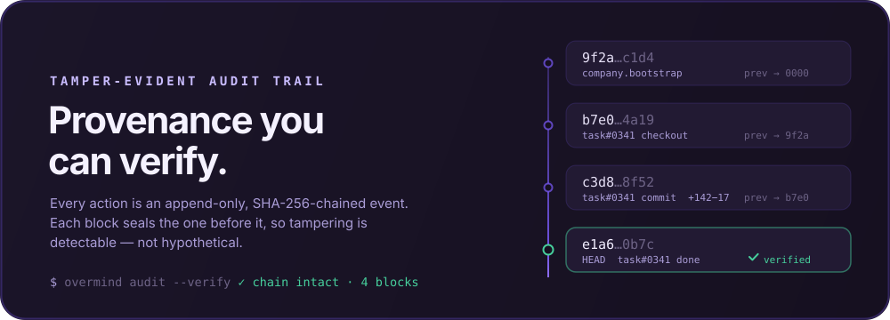
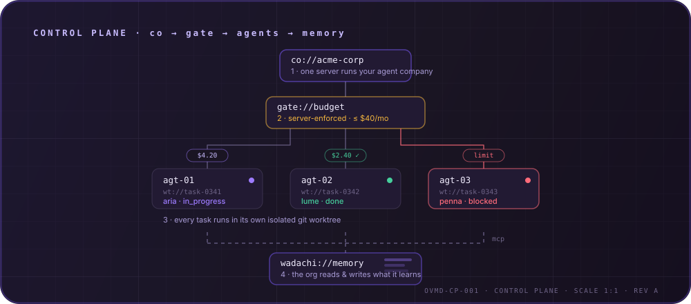
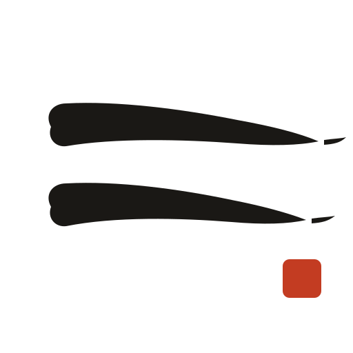

<!-- markdownlint-disable MD033 MD041 -->
<p align="center">
  <a href="#quickstart"><strong>Quickstart</strong></a> &middot;
  <a href="#several-people-one-company--over-tailscale"><strong>Several people</strong></a> &middot;
  <a href="docs/VISION.md"><strong>Vision</strong></a> &middot;
  <a href="docs/ARCHITECTURE.md"><strong>Architecture</strong></a> &middot;
  <a href="docs/ROADMAP.md"><strong>Roadmap</strong></a> &middot;
  <a href="https://overmind.eliacinti.dev/wiki"><strong>Wiki</strong></a>
</p>

<p align="center">
  
</p>

<p align="center">
  <a href="LICENSE"></a>
  
  
  <a href="https://github.com/EliaCinti/overmind/releases"></a>
</p>

<br/>

# Overmind — the mind that runs your agent company.

Open-source orchestration for teams of AI agents — **with a memory.**

**If an agent is an _employee_, Overmind is the _company_ — and it remembers.**

Overmind is a Rust server and a React UI that organizes AI agents into a company you actually run: a CEO you talk to, a team it proposes and you approve, an org chart with real reporting lines, tasks that produce code or documents, meetings that reach decisions, budgets enforced at checkout, an OS-level cage around every run, and a tamper-evident audit trail that says **who** did **what**. Self-hosted, one server, and — since M25 — **several people in one company**, reached over your own network.

What makes it different: Overmind is **memory-native**, and its brain is **[Wadachi](https://github.com/EliaCinti/wadachi) (轍)** — a persistent, semantically-searchable memory built for AI agents. Wadachi stores decisions with their _why_, the patterns your agents discover, and the mistakes already made, as a linked knowledge graph (a real Obsidian vault) that survives every session. Overmind ships with Wadachi as its **first-party brain**, on by default in the image; the interface stays open (any MCP memory server works) and Overmind runs perfectly without one — but plug a brain in and your organization genuinely _learns_.

**Manage the work, not the terminals.**

|        | Step                   | What happens                                                                                              |
| ------ | ---------------------- | --------------------------------------------------------------------------------------------------------- |
| **01** | Found a company        | Name it, pick its working language. It is born with a CEO and a brain that already knows who it is.        |
| **02** | Tell the CEO the idea  | It drafts the team — who to hire, with what role, who reports to whom — and you approve the org in a click. |
| **03** | Hand over the work     | Chat, or file a task: _code_ (an isolated git worktree, a diff to review) or a _document_ (artifacts).      |
| **04** | Decide                 | Approvals, meetings, budgets — in one inbox. Every decision carries the name of the person who made it.     |
| **05** | Bring people in        | Invite a colleague, add them to the company, work side by side from two machines over Tailscale.           |

<br/>

## Provenance you can verify

Everyone runs agents. Overmind can **prove what every agent — and every person — did.** Each action is an append-only, SHA-256-chained event, committed in the same transaction as the change it records, with the acting user's id **inside the hashed payload**. Break the chain and `GET /api/audit/verify` pinpoints the exact block that no longer seals; read the feed and every event names its actor.

<p align="center">
  
</p>

<br/>

## Overmind is right for you if

- ✅ You want a **company of agents you can talk to** — a CEO that decomposes what you ask into tasks and puts a team on it — not ten terminals and a prompt file
- ✅ You want agents that **learn from the org's past** instead of starting cold every session
- ✅ You want every `code` run in an **isolated git worktree inside an OS-level cage**, with the diff in front of you before anything merges — and `document` work (research, plans, comparisons) that needs no repo at all
- ✅ You want **budgets enforced server-side**, in real money or under a subscription, with the next run priced from the agent's own history
- ✅ You want **governance**: approve a start, convene or decline a meeting, pause or terminate an agent, roll back a config change — and know _who_ decided
- ✅ You want to **work with someone else** — two people, two machines, one company — without a cloud account in between
- ✅ You want it **self-hosted**: your machine, your data, an owner account you create on first run

<br/>

## Features

<table>
<tr>
<td align="center" width="33%">
<h3>🧠 Organizational Memory</h3>
One persistent brain per company — <strong>Wadachi</strong>, over MCP. Agents recall before working and store what they learn; decisions keep their rationale and rejected alternatives; a Memory view shows it all. <em>Nobody else has this.</em>
</td>
<td align="center" width="33%">
<h3>👔 A CEO and a team</h3>
Talk to the CEO; it proposes the org (names, roles, reporting lines) and you approve it in one click. Agents are <strong>archetype × domain</strong>: a <em>reviewer</em> in <em>security</em>, a <em>writer</em> in <em>media</em>. Specialists hand work to each other and escalate.
</td>
<td align="center" width="33%">
<h3>🏛️ Meetings & decisions</h3>
Agents request a room, you allow it; bounded round-robin deliberation with a turn cap; the decision goes back into memory and into every participant's next prompt. A room that runs out of money <em>waits</em>, it does not fail.
</td>
</tr>
<tr>
<td align="center">
<h3>🔒 Hash-Chained Audit, with an actor</h3>
Append-only, SHA-256-chained events; the acting user rides inside the hashed payload. Verification pinpoints the broken event; approvals and meetings say <em>decided by Elia</em>.
</td>
<td align="center">
<h3>💰 Budgets in both economies</h3>
Per-agent monthly caps, atomic with checkout, for tasks <em>and</em> chat turns. The reservation is <strong>learned from the ledger</strong> (the agent's own last runs); the adapter's <code>--max-budget-usd</code> is the brake. API key or Claude subscription — Overmind tells you which is paying and shows the plan's windows.
</td>
<td align="center">
<h3>🛡️ The cage</h3>
Deny-by-default OS sandboxing: <code>sandbox-exec</code> on macOS, an unprivileged uid plus Landlock in the container. The agent never reaches Overmind's database, your home, or the other runs. One predicate decides whether permissions may be skipped.
</td>
</tr>
<tr>
<td align="center">
<h3>🚪 The door, and several people</h3>
First run claims the instance (argon2id, hashed sessions). Then <strong>invites</strong>: single-use codes, seven days, hashed. <strong>Membership</strong> filters every company surface; any member brings in a colleague; the owner passes everywhere. Delete a company by typing its name.
</td>
<td align="center">
<h3>📎 Universal I/O</h3>
Attach files to chat and tasks; agents produce <strong>artifacts</strong> you download from the task; meeting transcripts are kept. <code>knowledge</code> tasks need no repository; <code>code</code> tasks get a worktree and a diff.
</td>
<td align="center">
<h3>🔌 Bring Your Own Agent — and MCP in every direction</h3>
Any agent CLI via <code>OVERMIND_AGENT_CMD</code> (Claude Code by default). <strong>Tools in the agent's hand:</strong> declare MCP servers on the box (Blender via BlenderMCP, a database, GitHub), grant them per agent in the hire dialog — an agent holds exactly what it was granted. And Overmind is an MCP <em>server</em> too: file tasks from your editor with a labelled, revocable token.
</td>
</tr>
</table>

<br/>

## How it works

The control plane, drawn to scale: one server runs your company, every action passes a server-enforced budget gate, every `code` task runs in an isolated git worktree, and every agent reads and writes organizational memory over MCP.

<p align="center">
  
</p>

1. **Company** — one server runs your whole agent org. Companies scope everything — and since M25 they have **members**. Agents have archetypes, domains, titles and reporting lines; the reporting DAG is enforced server-side. Projects cascade into goals and tasks; the CEO proposes the team and decomposes what you ask.
2. **Gate** — every action passes a server-enforced budget. Per-agent monthly caps are reserved atomically inside the checkout transaction — tasks and conversational turns alike — with an estimate learned from the agent's own ledger; an over-budget agent is stopped, and the incident is recorded.
3. **Agents** — every run is a real agent CLI inside an OS-level cage: `code` tasks in their own git worktree and branch, `knowledge` tasks in a scratch directory with no repository at all. Output, cost and artifacts are captured, sessions resume across restarts, and you review each diff or document before it lands.
4. **Memory and proof** — every agent reads and writes **Wadachi** over MCP, so the org remembers; Overmind also exposes itself over MCP so outside callers can file and read tasks. And every mutation appends an immutable, hash-chained audit event that names its actor.

<br/>

## Several people, one company — over Tailscale

Overmind is one server that everyone reaches. There is no cloud in between and no multi-server sync: a shared company lives on **one** Overmind and the other person reaches it over a network you both own. The host can be a **Mac** (natively or in the image), a **Linux** box or small VPS (the image), or a **Windows** PC running Docker Desktop (the image — there is no native Windows build, on purpose; the image is the Windows path and it is what CI tests). The colleague's machine can be anything with a browser and Tailscale; they install nothing of Overmind. The documented way to reach it is **[Tailscale](https://tailscale.com)** (or WireGuard): encryption and identity at the network layer, zero certificates, the right default for "my Mac and my friend's PC". The door does the rest.

```sh
# On the machine that runs Overmind, join your tailnet, then bind to its address.
tailscale up
tailscale ip -4                       # → 100.x.y.z

# from source
OVERMIND_ADDR=100.x.y.z:7070 cargo run

# with Docker: publish the port on the tailnet address only — never on 0.0.0.0
#   ports:
#     - "100.x.y.z:7070:7070"
```

Then the walk, in order:

1. **Claim early.** The first person to open `http://100.x.y.z:7070` creates the owner account — an unclaimed instance is exactly as open as before the door existed, so do this before sharing the address.
2. **Invite.** The owner clicks *Invite someone* in the top bar and gets a **single-use code, valid seven days**, stored hashed like a session token. Send it over whatever channel you already share; it is shown only once.
3. **Sign up.** Your colleague opens the same address from their machine — Windows, Linux, anything with a browser — and signs up with the code. A taken name hands the code back untouched; a spent or invented code refuses wordlessly.
4. **Add them to a company.** Any member opens *Members* and adds the colleague by name. **Membership is the filter**: they see the companies they are in, and nothing else — the company list, the board, the chat, the bare ids, the audit feed. The instance owner passes everywhere: they administer the box.
5. **Work side by side.** Both of you talk to the CEO, file tasks, approve runs and meetings. Every decision carries a name — *Approved by Elia*, *Declined by Marta* — read off the audit chain itself, so "who approved this" finally has an answer.

What is **honest to say**: billing is the owner's (a member cannot change how the instance pays); membership is an *organizational* boundary, not a security one — every account on the instance is one the owner invited; someone with the machine itself owns the process and always will; and Overmind does not terminate TLS — if you prefer a public hostname, put a reverse proxy (Caddy) in front and set `OVERMIND_COOKIE_SECURE=on`. The full reasoning is in [ADR-0032](docs/adr/0032-authentication-the-boundary-moves-off-the-machine.md), [ADR-0033](docs/adr/0033-invites-and-membership.md) and the [threat model](docs/THREAT-MODEL.md).

<br/>

## Problems Overmind solves

| Without Overmind                                                                                   | With Overmind                                                                                                   |
| -------------------------------------------------------------------------------------------------- | --------------------------------------------------------------------------------------------------------------- |
| ❌ Ten agent terminals open; on reboot you lose which did what.                                    | ✅ Work is task-based, sessions persist and resume across restarts, every step is on the board.                  |
| ❌ Every session your agent starts cold — you re-paste the same context and it repeats old mistakes. | ✅ The org remembers: agents load past decisions and patterns before they start.                                 |
| ❌ You orchestrate by hand: which agent, which prompt, in which order.                              | ✅ You tell the CEO; it drafts the team and decomposes the work, and you approve in one click.                   |
| ❌ Agents edit the same tree and clobber each other.                                                | ✅ One isolated git worktree per run, inside a cage; concurrent agents never interfere; you review each diff.     |
| ❌ A runaway loop burns hundreds of dollars before you notice.                                      | ✅ Budgets are enforced atomically at checkout, the next run is priced from the ledger, and the adapter has a brake. |
| ❌ "Did the agent really do what it claimed?" — you can't prove it.                                 | ✅ An append-only hash chain with the actor inside: tamper-evident, verifiable end to end.                        |
| ❌ Two people on one project means two setups and a shared password.                                | ✅ One server, an owner, invites, members — and a name on every decision.                                        |

<br/>

## Why Overmind is special

|                                    |                                                                                                                          |
| ---------------------------------- | ------------------------------------------------------------------------------------------------------------------------ |
| **Memory-native.**                 | A pluggable `MemoryProvider` over MCP — one brain per company, born knowing who the company is. Optional, never a lock-in. |
| **Atomic execution.**              | Task checkout and budget reservation commit in a single transaction — no double-work, no overrun.                        |
| **Tamper-evident by construction.**| The audit log is append-only (SQLite triggers) _and_ SHA-256 hash-chained, with the actor in the payload; `GET /api/audit/verify` proves it. |
| **Enforced, not suggested.**       | Archetype and domain choices compile to server-enforced config (task kinds, budget, gates) — a prompt can't override limits. |
| **Measured, not assumed.**         | Economies detected from the CLI, the cage proven with paired probes, the estimate learned from the ledger, the brake's overshoot written down (2.6×). |
| **Correctness-first stack.**       | Rust server (axum + SQLite), typed React UI — the concurrency-critical parts get compile-time guarantees.                 |
| **Graceful degradation.**          | No memory server? Broken one? Tasks run identically. Memory failures are logged, never fatal.                             |

<br/>

## Powered by Wadachi

<a href="https://github.com/EliaCinti/wadachi">
  <picture>
    <source media="(prefers-color-scheme: dark)" srcset=".github/assets/wadachi-logomark.svg">
    
  </picture>
</a>

Overmind's memory isn't a bolt-on cache — it's **[Wadachi](https://github.com/EliaCinti/wadachi) (轍**, the ruts a wheel leaves in the road**)**, a persistent-memory engine for AI agents that Overmind adopts as its first-party brain.

- **Semantic recall.** Agents ask "what do we know about this?" and get the relevant past — decisions, patterns, prior fixes — ranked by relevance, not keyword-matched.
- **Decisions with their _why_.** Wadachi records not just what was chosen but the rationale and the alternatives rejected — the context future agents actually need.
- **A living knowledge graph.** Memories link to each other (an Obsidian-compatible vault); Wadachi even runs a "sleep" pass that proposes consolidations of what the org has learned.
- **One brain per company.** Overmind provisions a brain directory per company and hands it to the server; the image pins Wadachi (semantic model baked in) so a fresh `docker compose up` remembers, offline.
- **Separate, by design.** Wadachi is its own project — use it without Overmind, or Overmind without it. The only coupling is the open MCP protocol; neither vendors the other's code.

The result: an organization of agents that doesn't start from zero every morning.

<br/>

## Quickstart

### Docker (recommended)

The image is self-contained: the agent CLI (Claude Code, pinned) and the memory engine (Wadachi, semantic model included) are already inside. The one thing it cannot bring is a way to pay — **give the agent credentials first**, or your first conversation will fail instead of answering:

```sh
git clone https://github.com/EliaCinti/overmind.git && cd overmind

# EITHER: pay with an API key — export it before starting
export ANTHROPIC_API_KEY=sk-ant-…

docker compose pull && docker compose up   # the published image → http://localhost:7070
# (or build it from this tree: docker compose up --build)

# OR: pay with a Claude subscription — sign in from the product (the notice
# above the first screen walks you through it), or once from the shell:
docker compose exec --user agent overmind claude setup-token
```

Open the browser, **create the owner account** (the first run offers exactly that), found a company and talk to its CEO. Every company gets its own brain, on by default, that already knows who the company is. The DB, worktrees, brains and the agent's sign-in persist on named volumes across restarts.

To let `code` tasks work on your repositories, mount them under `/repos` — see the comments in [`docker-compose.yml`](docker-compose.yml), which also cover swapping the agent CLI (`OVERMIND_AGENT_CMD`) or the memory server (`OVERMIND_MEMORY_CMD`) for your own. Agents need a toolchain the image lacks (LaTeX, a linter)? Add it at build time: `docker compose build --build-arg EXTRA_APT_PACKAGES="texlive-latex-base"`.

### From source

```sh
# 1. Build the UI (once, or after frontend changes)
cd web && npm install && npm run build && cd ..

# 2. Run the server — it serves the API, the live socket, and the built UI
cargo run                          # → http://127.0.0.1:7070

# Frontend dev with hot reload (proxies /api and /ws to the server):
cd web && npm run dev
```

On macOS every run is caged with `sandbox-exec`; a Claude subscription works inside the cage (the Keychain is granted read-only). macOS is the platform Overmind is run natively on; Linux and Windows use the image.

### Reach it from another machine

Overmind binds to loopback by default, on purpose. To share it, bind to a **Tailscale** address (see [above](#several-people-one-company--over-tailscale)) — or, for a public hostname, terminate TLS in a reverse proxy that preserves the `Host` header (Caddy does) and run Overmind with `OVERMIND_COOKIE_SECURE=on` behind it. Do not set that flag on plain-HTTP localhost: the browser would drop the cookie and every login would silently not stick.

### Organizational memory

**In the Docker image, memory is on by default** ([ADR-0031](docs/adr/0031-memory-on-by-default-in-the-image.md)): Wadachi ships inside it, semantic search included, model baked in. Set `OVERMIND_MEMORY_CMD=` (empty) to switch it off deliberately.

On a host, point Overmind at any MCP memory server exposing `get_context` / `store_memory` / `store_decision` — [Wadachi](https://github.com/EliaCinti/wadachi) is the reference:

```sh
OVERMIND_MEMORY_CMD="wadachi" cargo run
```

**Each company gets its own brain** ([ADR-0024](docs/adr/0024-managed-per-company-brain.md)), at `<data-dir>/companies/<company-id>/brain/`. Overmind creates the directory and passes it to the memory server as `BRAIN_DIR`; your personal brain is never touched.

> **Do not set `BRAIN_DIR` inside the command.** `OVERMIND_MEMORY_CMD="BRAIN_DIR=/my/brain wadachi"` runs through a shell, so that assignment wins over the one Overmind sets — every company would silently share `/my/brain`. If sharing one brain is what you want, say so with `OVERMIND_MANAGED_BRAIN=off`, which is visible and does not depend on shell precedence.

### Connect your editor (optional)

Overmind speaks MCP, so a Claude Code session — or anything else that does — can file work into a company and read its board ([ADR-0028](docs/adr/0028-overmind-as-an-mcp-server-for-outside-callers.md)).

Open **Connections** in the top bar, name what is connecting, and paste the configuration it gives you:

```json
{
  "mcpServers": {
    "overmind": {
      "type": "http",
      "url": "http://127.0.0.1:7070/mcp",
      "headers": { "Authorization": "Bearer <the token>" }
    }
  }
}
```

```sh
claude --mcp-config overmind.json --strict-mcp-config
```

You get `create_task`, `list_tasks`, `get_task`, `verify_audit` and `list_events`. **Filing work is not starting it:** a task arrives in the backlog, unassigned, and a person decides who picks it up — which is what keeps the budget and approval gates worth having. Withdraw a connection from the same panel and it stops working immediately.

### Configuration

Every setting is optional; the defaults are the working path.

| Env var | What |
|---|---|
| `OVERMIND_ADDR` | Listen address (default `127.0.0.1:7070`; the image binds `0.0.0.0:7070` inside the container and compose publishes it on loopback) |
| `OVERMIND_DB` | SQLite URL (default `sqlite://overmind.sqlite`) |
| `OVERMIND_DATA_DIR` | Worktrees, brains, artifacts, attachments (default `./overmind-data`) |
| `OVERMIND_AGENT_CMD` | Agent adapter command (default: the Claude Code CLI, `claude -p … --output-format stream-json --verbose`). A custom adapter is never interrogated for how it pays |
| `OVERMIND_MEMORY_CMD` | MCP memory server command (unset = no memory; the image sets `wadachi`; empty = off deliberately) |
| `OVERMIND_AGENT_TOOLS` | A file of MCP servers agents *may* be granted, in the CLI's `{"mcpServers": …}` shape — e.g. Blender via BlenderMCP ([example](docs/examples/agent-tools.blender.json)). Declared here by the operator, granted per agent in the hire dialog; an agent holds exactly what it was granted ([ADR-0036](docs/adr/0036-tools-in-the-agents-hand.md)) |
| `OVERMIND_MEMORY_POOL` | Concurrent memory connections (default `4`) |
| `OVERMIND_MANAGED_BRAIN` | `off` = one shared brain instead of one per company (default on) |
| `OVERMIND_SANDBOX` | `off` empties the whole set of cage mechanisms — agents become read-only (default on) |
| `OVERMIND_SANDBOX_ALLOW` | Colon-separated extra writable paths, to fit a toolchain without turning the cage off |
| `OVERMIND_AGENT_UID` / `OVERMIND_AGENT_GID` | Unprivileged uid/gid agent work runs as (the image uses `10001`; on Linux set your own `id -u` so `code` tasks can write mounted repos) |
| `OVERMIND_AGENT_HOME` | The agent's own writable `HOME` (the image: `/home/agent`) |
| `OVERMIND_REPOS_DIR` | Where mounted repositories live, so a wrong workspace path gets an answer naming what is visible (the image: `/repos`) |
| `OVERMIND_ECONOMY` | `key` or `subscription`: declare the economy instead of detecting it |
| `OVERMIND_START_ESTIMATE_CENTS` | The flat reservation per start — the fallback while an agent's ledger has fewer than three runs of that kind (default `50`) |
| `OVERMIND_COOKIE_SECURE` | `on` marks the session cookie `Secure` — required behind TLS, wrong on plain-HTTP localhost |
| `OVERMIND_HEARTBEAT_SECS` | Scheduler tick (default `30`) |
| `OVERMIND_SESSION_TIMEOUT_SECS` | Kill sessions over this (default `3600`) |
| `OVERMIND_WEB_DIR` | Built SPA to serve (default `./web/dist`) |

Build args for the image: `CLAUDE_CODE_VERSION` (pinned agent CLI), `WADACHI_VERSION` (pinned memory provider), `EXTRA_APT_PACKAGES` (toolchains your agents need). `ANTHROPIC_API_KEY` is passed through to the container only when it exists on the host.

<br/>

## Status

Pre-alpha, built in the open. Twenty-six milestones, each closed by tests and a live acceptance: company & org chart, a CEO you talk to and a team it proposes, tasks for code and documents with attachments and artifacts, meetings with bounded deliberation, heartbeats & recovery, budgets in both economies with an estimate learned from the ledger, the cage on macOS and in the container, a hash-chained audit with the actor inside, organizational memory over MCP (on by default in the image), an owner account at first run, invites and membership for several people in one company, company deletion, and a name on every decision. What's next lives in the [roadmap](docs/ROADMAP.md); what is deliberately *not* promised is in the [threat model](docs/THREAT-MODEL.md).

The design is documented before the code: see [VISION](docs/VISION.md), [ARCHITECTURE](docs/ARCHITECTURE.md), the [UX principles](docs/UX.md), and the [Architecture Decision Records](docs/adr/). User guides and FAQ live on the [wiki](https://overmind.eliacinti.dev/wiki).

<br/>

## Prior art & credits

Overmind's org layer is inspired by [Paperclip](https://github.com/paperclipai/paperclip) (MIT) and its execution layer by [Vibe Kanban](https://github.com/BloopAI/vibe-kanban). It adopts Paperclip's vocabulary and semantics where they serve (see [PAPERCLIP-ALIGNMENT](docs/PAPERCLIP-ALIGNMENT.md)) and contains **no AGPL code**. The organizational memory is powered by **[Wadachi](https://github.com/EliaCinti/wadachi)** — a sibling project, not a sub-component — integrated over MCP; the tamper-evident audit chain is Overmind's own.

## License

MIT — self-hosted, your machine, your data, an owner account you create yourself.
