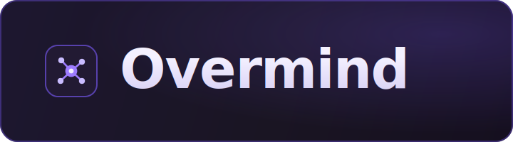
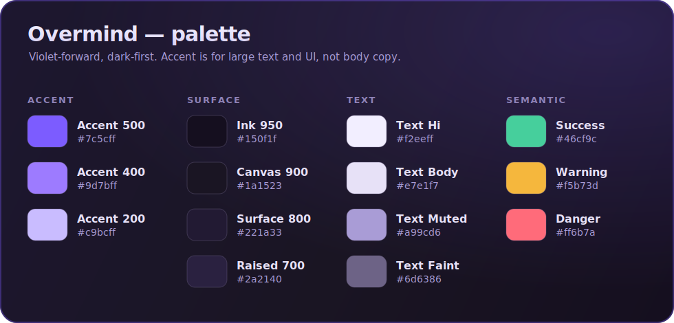

<!-- markdownlint-disable MD033 MD041 -->
<p align="center">
  
</p>

# Overmind — Brand Guide

Overmind is the mind that runs your agent company. The identity should feel the
same way the product does: **calm, precise, and quietly powerful** — a modern
developer tool, not a toy. The chosen identity is **Living Memory (轍)**: your
org leaves a track, and Overmind remembers it. The mark and hero encode that as
faint ruts of the past brightening into a luminous present. This guide is the
source of truth for palette, typography, logo usage, and voice. When in doubt,
match the assets already in [`.github/assets/`](../.github/assets/) rather than
inventing something new.

> The identity is **dark-first and violet-forward**, with a **single warm memory
> ember** as its one signature tell. Every brand asset is a self-contained dark
> card so it renders identically in light and dark GitHub themes. No pure black
> or pure white fills — ever.

---

## Palette

<p align="center">
  
</p>

One accent, a stack of near-black surfaces, a tuned set of text tints, and three
semantic colors. That is the whole system — resist adding a second accent. There
is exactly **one sanctioned warm exception**: the memory ember (below), reserved
for the memory tell and nothing else.

### Accent — violet

| Token        | Hex       | Role |
| ------------ | --------- | ---- |
| `accent-500` | `#7c5cff` | Primary accent: links, focus rings, primary buttons, active nodes. The brand color. |
| `accent-400` | `#9d7bff` | Gradient top-stop and hover state. Pair with `accent-500` for the signature violet gradient. |
| `accent-200` | `#c9bcff` | Accent tint on dark: satellite nodes, quiet highlights, secondary accent text. |

> **Contrast note.** `#7c5cff` on `#1a1523` is ~3.8:1 — fine for large text,
> icons, borders, and UI chrome, but **below 4.5:1 for body copy.** For accent
> text at body size, step up to `accent-200`.

### Memory ember — amber

The one warm color in the system. It is the **memory tell** of the Living Memory
identity — where the violet track collapses into the present, a warm ember shows
that the moment is *remembered*, not just lit.

| Token          | Hex       | Role |
| -------------- | --------- | ---- |
| `memory-ember` | `#f0c07a` | The single warm secondary. The present node's ember core in the hero, and the one amber phrase on the signature line ("Overmind remembers it."). |

> **Use it for the memory tell only.** The ember marks *one* thing per
> composition: the present/"now" node where the track lands, and — as text — the
> single clause that names what Overmind does with the track. It is **not** a
> general accent (that's violet) and it is **not** semantic (success/warning/
> danger own state). If amber shows up twice on a surface, one of them is wrong.
> Its lit hot core in the hero is a warm off-white (`#f4ecd8`); that is a glint
> of the same ember, not a second token.

### Surface — near-black

| Token         | Hex       | Role |
| ------------- | --------- | ---- |
| `ink-950`     | `#150f1f` | Deepest shade; base of background gradients. |
| `canvas-900`  | `#1a1523` | **Canonical background.** The default page/canvas color. |
| `surface-800` | `#221a33` | Cards, panels, the logomark tile. |
| `raised-700`  | `#2a2140` | Raised surfaces: popovers, hovered rows, nested panels. |

### Text — on dark

| Token        | Hex       | Role |
| ------------ | --------- | ---- |
| `text-hi`    | `#f2eeff` | High-emphasis text, headings, the bright center of the mark. Use in place of pure white. |
| `text-body`  | `#e7e1f7` | Default body copy. |
| `text-muted` | `#a99cd6` | Secondary text, captions, labels. |
| `text-faint` | `#6d6386` | Disabled text, separators, bullet dots. |

### Semantic

| Token     | Hex       | Role |
| --------- | --------- | ---- |
| `success` | `#46cf9c` | Passing checks, green budget, healthy runs. |
| `warning` | `#f5b73d` | Approaching a limit, needs attention. |
| `danger`  | `#ff6b7a` | Failed run, blown budget, broken audit chain. |

Semantic colors are for **state**, never decoration — if it isn't communicating
success/warning/danger, it should be violet, a surface tone, or (for the memory
tell only) the amber ember.

---

## Typography

Two typefaces, matching the app (`web/src/index.css`): **Inter** for everything
human-facing, **JetBrains Mono** for everything machine-valued. The split is
load-bearing — monospace is how the product signals "this is a real value": a
hash, a budget, an id, a timestamp, a label. Both are shipped as variable fonts
in the app; brand SVGs name them first and fall back to a clean system sans so a
README still renders crisply where the webfont is absent.

**Display / UI — Inter**

```
'Inter Variable', 'Inter', ui-sans-serif, system-ui, -apple-system, sans-serif
```

**Monospace — JetBrains Mono** (hashes, budgets, ids, timestamps, labels)

```
'JetBrains Mono Variable', 'JetBrains Mono', ui-monospace, SFMono-Regular, Menlo, monospace
```

| Style       | Font | Weight | Tracking | Use |
| ----------- | ---- | ------ | -------- | --- |
| Wordmark    | Inter | 700   | `-2.5`   | The "Overmind" lockup only. |
| Heading     | Inter | 700   | `-0.5`   | Section titles. |
| Body        | Inter | 400–500 | `0`    | Running text. |
| Eyebrow     | JetBrains Mono | 600 | `+3.5`, uppercase | Kicker over the wordmark (e.g. `MEMORY-NATIVE ORCHESTRATION`). |
| Label / pill | JetBrains Mono | 600–700 | `+1.5`, uppercase | Column headers, tags, hashes, budgets, ids. |

Tighten tracking as size grows; the wordmark is deliberately tight (`-2.5`, as
shipped in the hero). Never letter-space Inter body copy — the wide tracking is a
mono-only device for labels and the eyebrow.

---

## Logo

Overmind's mark is a **memory trace**: faint ruts (轍) of the past on the left
brighten as they converge — accumulating stored-memory dots along the way — into
a bright violet **present node** with a warm amber ember at its core. It reads
left-to-right as *your org leaves a track; Overmind remembers it, and acts now.*
The bright node is the present; the ember is the memory tell. This is the reading
shipped in [`hero.svg`](../.github/assets/hero.svg) — treat the hero as the
canonical reference for the mark's current form.

- **Logomark** — [`.github/assets/brand/logomark.svg`](../.github/assets/brand/logomark.svg):
  the mark in its rounded violet-stroked tile. Use where space is square or tight
  (avatars, favicons, app chrome).
- **Wordmark** — [`.github/assets/brand/wordmark.svg`](../.github/assets/brand/wordmark.svg):
  logomark + "Overmind" lockup. Use in READMEs, docs headers, and slides.

> **Asset note.** The standalone `logomark.svg` / `wordmark.svg` still render the
> earlier orchestration-hub geometry and are being brought in line with the
> memory-trace reading above. Until they are re-rendered, use the hero for the
> mark and this guide for the intent.

### Do

- Keep clear space around the mark equal to the diameter of the present node.
- Preserve the direction of travel: track flows *into* the present node, past
  (faint) → now (bright). Never reverse it.
- Keep the amber ember at the core of the present node only — one ember, one mark.
- Place the mark on `canvas-900`, `surface-800`, or its own dark tile.
- Scale the whole asset uniformly; the mark is built to hold up small.
- Use the provided SVGs as-is — they are already theme-safe.

### Don't

- ❌ Recolor the mark, re-stroke the tile, or swap the violet for another hue.
- ❌ Spread the amber ember beyond the present node, or add a second ember.
- ❌ Flatten the past→present brightness gradient into uniform ruts, or reverse it.
- ❌ Put the mark on a pure-white or busy photographic background.
- ❌ Stretch, skew, rotate, or add drop shadows / outer glows.
- ❌ Rebuild the wordmark in a different typeface or re-letter-space it.
- ❌ Detach the ruts from the present node, or crop the tile.

---

## Voice & tone

Overmind talks like a **senior engineer who respects your time**: precise,
confident, and free of hype. It explains the mechanism, not the magic.

- **Clear over clever.** Say what a thing does. "Isolated worktrees," not
  "next-gen agent sandboxing."
- **Concrete over grand.** Lead with the invariant — atomic budgets,
  hash-chained audit, memory-native — not adjectives.
- **Calm, not loud.** No exclamation walls, no emoji confetti. One sharp line
  beats three excited ones.
- **Honest about edges.** Say when something is optional (Wadachi always is),
  experimental, or not done yet.
- **Vocabulary is canonical.** company / project / goal / task — never
  ticket / issue / mission. See [`PAPERCLIP-ALIGNMENT.md`](PAPERCLIP-ALIGNMENT.md).

**Tagline:** *the mind that runs your agent company.*

One-liner: *Overmind orchestrates a company of AI agents — isolated worktrees,
atomic budgets, a hash-chained audit log, and organizational memory.*

---

## Assets

| File | What |
| ---- | ---- |
| [`.github/assets/brand/logomark.svg`](../.github/assets/brand/logomark.svg) | Standalone mark in its rounded violet tile. |
| [`.github/assets/brand/wordmark.svg`](../.github/assets/brand/wordmark.svg) | Logomark + "Overmind" lockup. |
| [`.github/assets/brand/palette-swatches.svg`](../.github/assets/brand/palette-swatches.svg) | The palette, rendered. |

*License: MIT, same as the project. Reuse the marks to refer to Overmind; don't
imply endorsement or modify them.*
